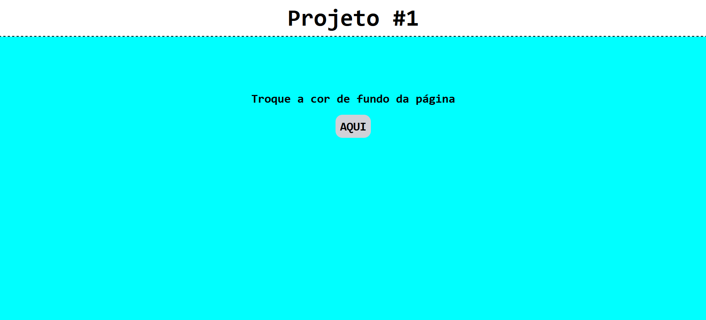

# Projeto 1

Este projeto é uma aplicação web básica que permite aos usuários trocar as cores da interface de forma dinâmica. A funcionalidade principal é uma função JavaScript que altera as cores do fundo da página aleatoriamente entre as 16 cores básicas do CSS. Isso proporciona uma experiência interativa e divertida.

## Funcionalidades

- Troca dinâmica de cores
- Interface amigável e interativa
- Personalização em tempo real

## Tecnologias Utilizadas

- HTML
- CSS
- JavaScript

## Como Usar

1. Clone o repositório.
2. Abra o arquivo `index.html` em um navegador.
3. Utilize os controles de cor para alterar a aparência da página.

Aproveite a personalização e divirta-se explorando as diferentes combinações de cores!