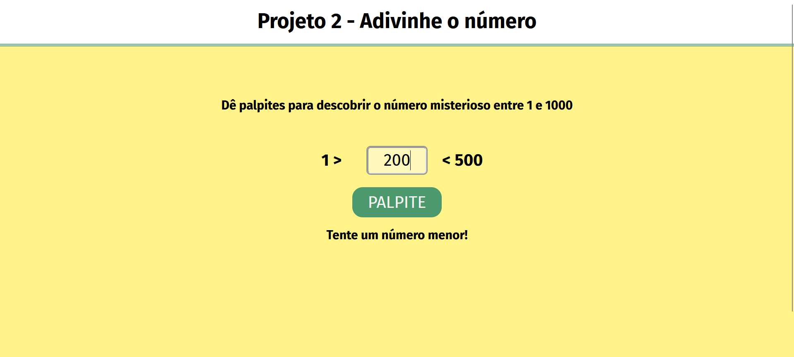

# Projeto 2 - Adivinhe o Número

Este é um projeto simples de um jogo de adivinhação de números. O objetivo do jogo é adivinhar um número misterioso entre 1 e 1000.

## Funcionalidades

- O usuário pode inserir palpites para tentar adivinhar o número misterioso.
- O jogo fornece feedback se o palpite está correto, muito alto ou muito baixo.
- Interface simples e intuitiva.

## Tecnologias Utilizadas

- HTML
- CSS
- JavaScript

## Estrutura do Projeto

- `index.html`: Contém a estrutura básica do HTML e a interface do usuário.
- `style.css`: Contém os estilos para a interface do usuário.
- `main.js`: Contém a lógica de programação do jogo, a função que realiza a escolha de um número aleatório e a cada clique do botão compara este número com o que foi digitado pelo jogador.

## Como Executar o Projeto

1. Clone o repositório para o seu ambiente local.
2. Abra o arquivo `index.html` em um navegador web.

## Contribuição

Sinta-se à vontade para contribuir com melhorias para este projeto. Para isso, siga os passos abaixo:

1. Faça um fork deste repositório.
2. Crie uma branch para a sua feature (`git checkout -b feature/nova-feature`).
3. Commit suas mudanças (`git commit -m 'Adiciona nova feature'`).
4. Faça um push para a branch (`git push origin feature/nova-feature`).
5. Abra um Pull Request.

## Licença

Este projeto está licenciado sob a [MIT License](LICENSE).
